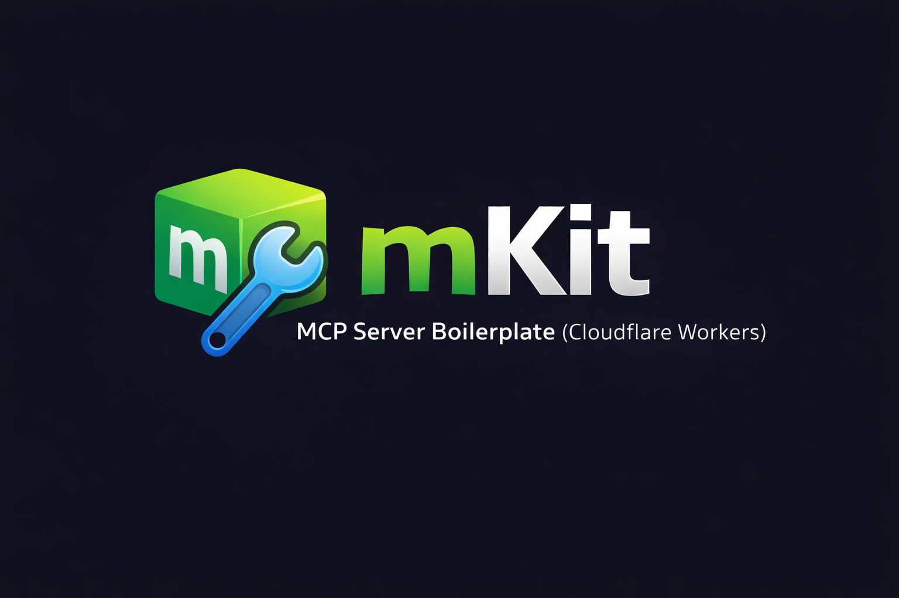

# mKit — MCP Server Boilerplate for Cloudflare Workers

This repository is the official boilerplate for bootstrapping MCP servers on Cloudflare Workers with OAuth 2.1, Stripe billing, and OpenAI Apps SDK UI integration.

Last updated: 2026-01-08
Owner: TBD (set maintainer/team)
Review cadence: Quarterly (confirm)

## Doc requirements

- Audience tier: Beginner to intermediate
- Scope: Using this repo as a template to configure, run, and deploy an MCP server
- Non-scope: OAuth provider setup details, Stripe account setup, and product-specific UI design
- Required approvals: Maintainer approval for production changes (confirm)

## Table of contents

- [Doc requirements](#doc-requirements)
- [Risks and assumptions](#risks-and-assumptions)
- [Prerequisites](#prerequisites)
- [Quickstart](#quickstart)
- [Common tasks](#common-tasks)
- [Troubleshooting](#troubleshooting)
- [Acceptance criteria](#acceptance-criteria)
- [Evidence bundle](#evidence-bundle)
- [Reference](#reference)

## Risks and assumptions

- Assumptions: You control a Cloudflare account, OAuth providers, and a Stripe account.
- Risks / blast radius: Misconfigured secrets or webhook signing can cause auth/payment failures.
- Rollback / recovery: Rotate secrets and redeploy; disable affected routes until fixed.

## Prerequisites

- Required: Node.js 20+, pnpm, Wrangler CLI, Cloudflare account
- Optional: Stripe and OAuth provider accounts (needed to enable payments and login)

## Quickstart

### 1) Install dependencies

```sh
pnpm install
```

### 2) Configure environment

```sh
cp .env.example .env
```

Update `.env` with your values and create the KV namespace in Cloudflare:

```sh
pnpm wrangler kv namespace create OAUTH_KV
```

Update `wrangler.jsonc` with the namespace IDs from the command output.

### 3) Run locally

```sh
pnpm dev
pnpm dev:worker
```

Run each command in a separate terminal.

### 4) Verify

Expected output:

- Vite prints a local dev server URL without errors.
- Wrangler prints a local worker URL and no startup errors.
- A request to `/mcp` returns a non-5xx response.

## Common tasks

### Create a new tool to expose MCP functionality

- What you get: A new MCP tool registered at server startup.
- Steps:

```sh
# Add a new file under src/tools/free/ or src/tools/paid/
```

- Verify: The tool is registered in the server startup logs.

### Add a new widget page for the Apps SDK UI

- What you get: A new auto-discovered widget route.
- Steps:

```sh
# Add an HTML file in src/app/routes/ and a React component in src/app/components/
```

- Verify: The route is present in the generated manifest at build time.

### Build and deploy to Cloudflare

- What you get: A live MCP endpoint at your worker URL.
- Steps:

```sh
pnpm build-deploy
```

- Verify: `pnpm wrangler deploy` reports success and the worker URL responds.

### Run quality checks

- What you get: Type safety and test validation.
- Steps:

```sh
pnpm typecheck
pnpm lint
pnpm test
```

- Verify: Each command exits with status 0.

## Troubleshooting

### Symptom: `wrangler dev` fails with missing KV namespace

Cause: `wrangler.jsonc` has placeholder KV IDs.
Fix:

```sh
pnpm wrangler kv namespace create OAUTH_KV
```

Update `wrangler.jsonc` with the real IDs and retry.

### Symptom: OAuth login fails or tokens are rejected

Cause: OAuth issuer or JWKS URL is incorrect.
Fix: Re-check `OAUTH_ISSUER` and `OAUTH_JWKS_URI` in `.env`.

### Symptom: Stripe webhooks are rejected

Cause: Webhook signing secret does not match Stripe configuration.
Fix: Update `STRIPE_WEBHOOK_SECRET` with the value from Stripe dashboard.

## Acceptance criteria

- [ ] `.env` created from `.env.example` with valid values.
- [ ] KV namespace IDs set in `wrangler.jsonc`.
- [ ] Local dev runs without startup errors.
- [ ] At least one tool is registered and callable.
- [ ] Deployment succeeds in Cloudflare.
- [ ] Troubleshooting steps are validated by maintainers.

## Evidence bundle

- Lint outputs (Vale/markdownlint/link check): Not run (no configs found).
- Brand check output: Not run (no brand check script found).
- Readability output (if available): Not run (no readability script found).
- Checklist snapshot: Pending maintainer confirmation.

## Reference

- Project layout: `src/worker`, `src/auth`, `src/billing`, `src/tools`, `src/app`
- Commands: `pnpm dev`, `pnpm dev:worker`, `pnpm build`, `pnpm deploy`, `pnpm test`, `pnpm lint`
- Related docs: `docs/architecture.md`, `docs/development.md`, `docs/deployment.md`, `docs/configuration.md`, `docs/runbook.md`
